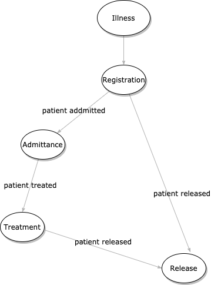

# Message Cloud Contract

## Overview

### Purpose
This project is a demonstration of a Spring Cloud Contract implementation using messaging with Spring Cloud Streams.

This project uses Spring Cloud Streams 3.0.x, which has significant enhancements and differences compared to the version 2.x variants.

### Scenario
This example uses a extremely simplified hospital admission scenario to illustrate how contracts can be used to enforce the interfaces between two systems used for admitting patients to a hospital.

- Registration (supplier/producer)
- Admittance (consumer)



## Setup

### Local Development Environment
This sample application uses RabbitMQ to manage the messages.  A RabbitMQ instance must be setup to run the application.

#### MacOS/Linux

The easiest way to run RabbitMQ on MacOS and Linux is in a docker container.  An official RabbitMQ docker image can be installed and run by using the following steps:
1. Make sure Docker is installed on your workstation.
2. Pull the latest RabbitMQ docker image `docker pull rabbitmq`
3. Use the image to start a container and run RabbitMQ `docker run -d --hostname localhost --name local-rabbit -p 15672:15672 -p 5672:5672 rabbitmq:3-management`
4. The Docker container can be stopped by using the following command `docker container stop local-rabbit`

#### Windows (No Docker)

It can be difficult to run Docker on Windows in many cases, so RabbitMQ can be installed directly.

## Contract Producer Sub-Project (message-contract-producer)

### Producer (Supplier) Configuration

Spring Cloud Streams 3.x will automatically configure a channel, but a destination can be configured in the `application.yml` if desired.

```yaml
spring:
  cloud:
    stream:
      bindings:
        register-out-0:
          destination: registration-channel
          group: registered
```

## Contract Consumer Sub-Project (message-contract-consumer

### Consumer Configuration

## References

- [Introducing Spring Cloud Contract](https://cloud.spring.io/spring-cloud-contract/reference/html/getting-started.html#getting-started-introducing-spring-cloud-contract)
- [Enforcing Spring Cloud Contracts Over AMQP](https://novotnyr.github.io/scrolls/enforcing-spring-cloud-contracts-over-amqp/)
- [Contracts on the Producer Side 2.1.3.BUILD-SNAPSHOT](https://cloud-samples.spring.io/spring-cloud-contract-samples/tutorials/contracts_on_the_producer_side.html#_producer_flow_1)
- [Spring Cloud Streams 3.0.x](https://cloud.spring.io/spring-cloud-static/spring-cloud-stream/3.0.0.RELEASE/reference/html/spring-cloud-stream.html#spring-cloud-stream-reference)
